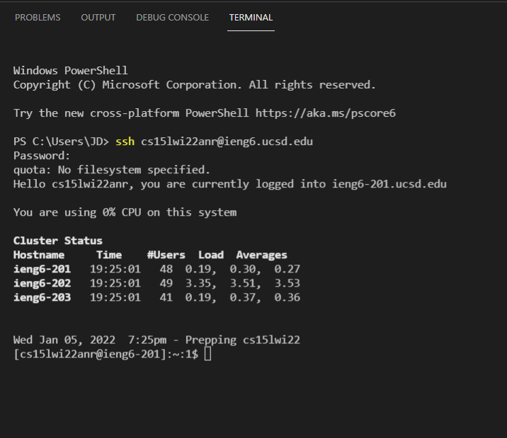

[Index](https://jheidenr.github.io/cse15l-lab-reports)

# Step 1: Install VS Code

The first step is to install VS Code. Go to this [link](https://code.visualstudio.com/) and follow the instructions for your operating systsem on the website.


It should look like this when you open it.

# Step 2: Remotely Connect

First install OpenSSH in order to be able to connect to other computers. To do this you must:

1. Go to Settings/Apps/Apps & Features/Optional Features
2. Click "Add a Feature" and install **OpenSSH Client** and **OpenSSH Server**

Next, you must go to [UCSD's Account Lookup Website](https://sdacs.ucsd.edu/~icc/index.php) and put in your information to find your account name. Then click **Change your password** to chang eyour accounts password and activate your account.

Now open a new terminal in VS Code. Then input this command:

`ssh cs15lwi22XXX@ieng6.ucsd.edu`

but replace `XXX` with the letters found at the end of your username. When you first connect you may be given a long message and asked to say yes or no. Type `yes` to this message and enter your password.

**Note: You will not be able to see the characters of your password as you enter them**



Your terminal should look like this when you fully complete the process.

# Step 3: Try Some Commands

Here you can see that I tried these commands:

* `cd (directory)/` - changes your working directory to the one that is specified

*  `ls` - lists the names of the files under the working directory

*  `ls -lat` - combines the `l`, `a`, and `t` tags to give a long listing of every file in the working directory, with the files sorted from newest to oldest

* `pwd` - prints the path to the current working directory


Once your are done playing around with the commands, type `exit` to logout of the server.


# Step 4: Move Files Around With scp

First create a file anywhere on your computer and name it **WhereAmI.java**. Then open it and paste the following code into the file:

```
class WhereAmI {
  public static void main(String[] args) {
    System.out.println(System.getProperty("os.name"));
    System.out.println(System.getProperty("user.name"));
    System.out.println(System.getProperty("user.home"));
    System.out.println(System.getProperty("user.dir"));
  }
}
```
Run the program on your own computer by using

`javac WhereAmI.java` and `java WhereAmI`


Then copy the file to the server by using the command:

**Replace `XXX` with the letters from your account**

`scp WhereAmI.java cs15lwi22XXX@ieng6.ucsd.edu:~/`

You will be asked for you password as if your were connecting to the server. Once the file is copied, log back into the server and use `ls` and check if you can see the file. Then run the file on the server.


Above, you can see me running the file on my own computer and then copying it to the server.

Below, You can see me log back into the server and run the code there. Notice the different output of the program.


# Step 5: Create an SSH Key

To create an SSH key use the `ssh-keygen -t ed25519` command. This will prompt you to enter a destination and password for your key, but you should leave both of these empty. Then, follow this string of commands in order to more securly store your key:
```
Get-Service ssh-agent | Set-Service -StartupType Manual

Start-Service ssh-agent

Get-Service ssh-agent

ssh-add ~\.ssh\id_ed25519
```

Next, log into the server and run the command `mkdir .ssh` and then exit the server.

Finally, run the command `scp /Users/user/.ssh/id_rsa.pub cs15lwi22@ieng6.ucsd.edu:~/.ssh/authorized_keys` in order to copy your public key onto the server.

**Replace User with your computer's user**

Below you can see that I am able to `ssh` without putting in my password, which can save a lot of time in the long run.


# Step 6: Optimizing Remote Running

Now that you don't have to put in your password every time you log into the server, certain processes become much faster.

If you want to run multiple commands with one use of the terminal, just separate your commands with a semicolon.

`javac WhereAmI.java; java WhereAmI`

If you want to run commands after logging onto a server, just surround the other commands with quotations.

`ssh cs15lwi22XXX@ieng6.ucsd.edu "javac WhereAmI.java; java WhereAmI"`

Below you can see me run:

`scp WhereAmI.java cs15lwi22anr@ieng6.ucsd.edu:~/; ssh cs15lwi22anr@ieng6.ucsd.edu "javac WhereAmI.java"; ssh cs15lwi22anr@ieng6.ucsd.edu "java WhereAmI"`

This string of commands copies WhereAmI.java to the server and then logs into the server to compile and run the code.

