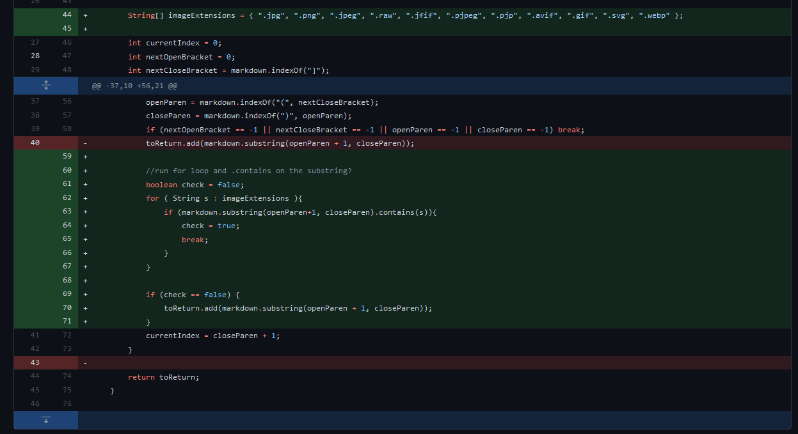
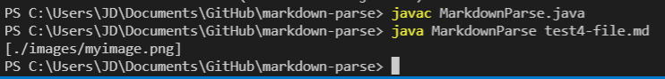
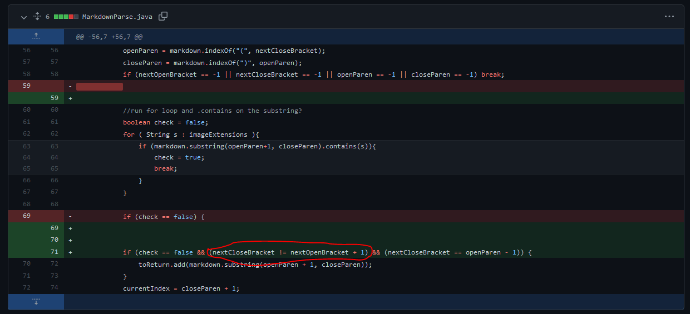
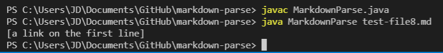
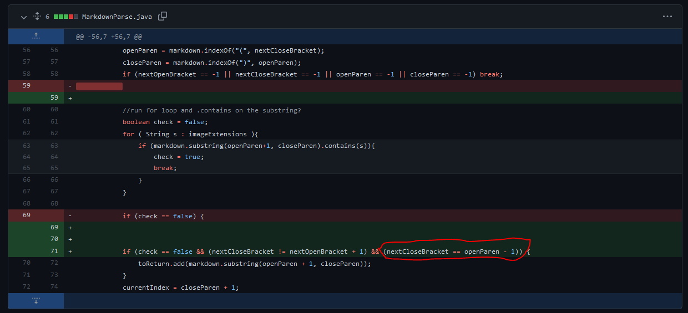
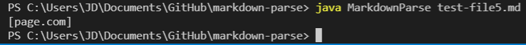

[Index](https://jheidenr.github.io/cse15l-lab-reports)

# Change 1

## Change and Symptom

This change was prompted from [test4-file.md](https://github.com/jheidenr/markdown-parse/blob/main/test4-file.md). The symptom of the failure-inducing input was that it printed out an image file as a link:

The correct output would be an empty arraylist.

## Reflection
This symptom was produced from the fact that our code had no way to distinguish an image file from a valid link. The failure-inducing input had the correct formatting for a link, but an invalid link inside of the parentheses; so we updated our code to include a system to scan the interior of the parentheses for any image tags (such as *.png* or *.jpeg*).

# Change 2

## Change and Symptom

This change was prompted from [test-file8.md](https://github.com/jheidenr/markdown-parse/blob/main/test-file8.md). The symptom of the failure-inducing input was that it printed out a link when there was not any content between the brackets:

The correct output would just be an empty arraylist.

## Reflection
This symptom was produced from the fact that our code had no way of detecting the content between the brackets. The failure-inducing input had empty brackets; so we updated our code to check that the indexes of the brackets were not next to eachother, before adding a substring to toReturn.

# Change 3

## Change and Symptom

This change was prompted from [test-file5.md](https://github.com/jheidenr/markdown-parse/blob/main/test-file5.md). The symptom of the failure-inducing input was that it printed out a link when the brackets and the parentheses were separated:

The correct output would be an empty arraylist.

## Reflection
This symptom was produced from the bug that our code had no way to detect whether the bracket portion and the parentheses portion were connected. The failure-inducing input had disconnected parentheses; so we updated our code to check if the index of the opening parentheses was next to the index of the closing brackets.