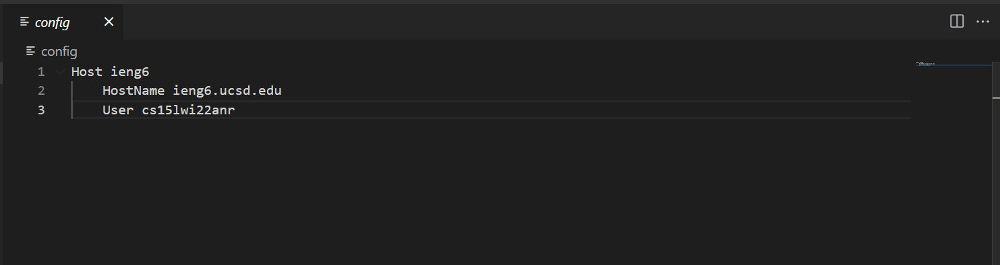
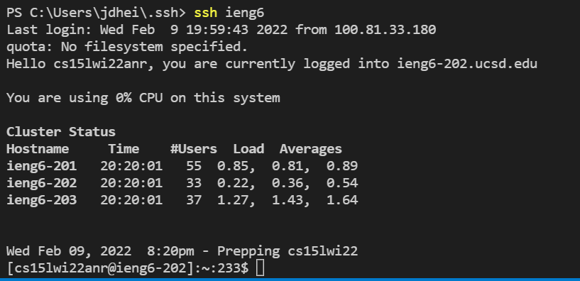
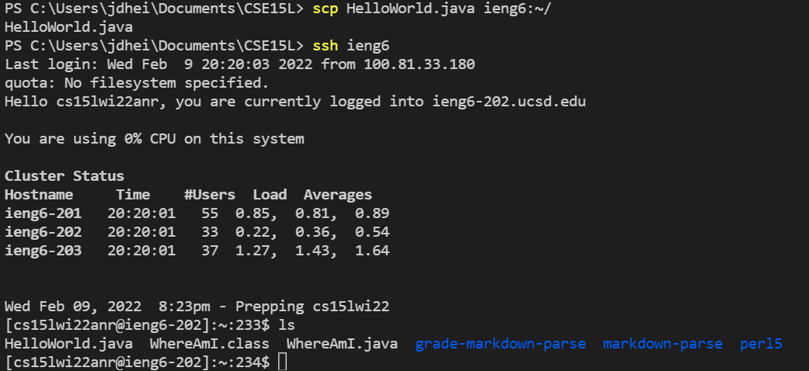

[Index](https://jheidenr.github.io/cse15l-lab-reports)

# Lab Report 3 - Streamlining ssh configuration

## Creating a config File

In the image above, I created a file called config in my .ssh directory using vscode. In the file I added the host alias, the host name and my username.

## Using the `ssh` Command

In the image above, I was able to use `ssh ieng6` to log into ieng6. Without the config file, I would have had to log in with the full address of ieng6.

## Copying Files With an Alias

In the image above, I was able to use the `scp` command while only using ieng6, not the full address. Towards the bottom of the image you can see me use the `ls` command to show that the file was copied correctly.