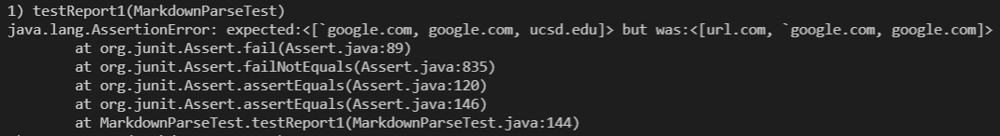
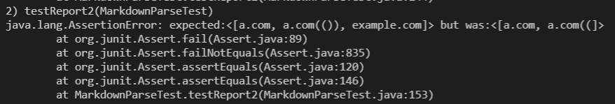
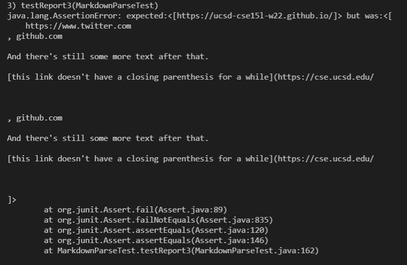
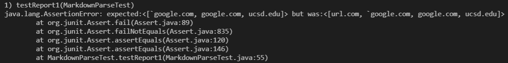
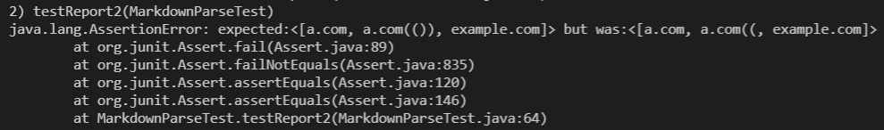
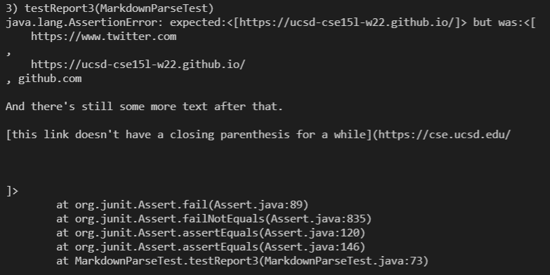

[Index](https://jheidenr.github.io/cse15l-lab-reports)

# Lab Report 4

[My Repository](https://github.com/jheidenr/markdown-parse)

[Reviewed Repository](https://github.com/RyanRongY/markdown-parse)

## My Repository - Snippet 1

### Expected Output

According to the CommonMark demo site, MarkdownParse should output:
>[`google.com, google.com, ucsd.edu]

### Code
```
@Test
public void testReport1() throws IOException{
    Path fileName = Path.of("report-test1.md");
    String contents = Files.readString(fileName);
    strList = MarkdownParse.getLinks(contents);
    System.out.println(strList);

    assertEquals(List.of("`google.com", "google.com", "ucsd.edu"), this.strList);
}
```

### Actual Output

As you can see, my version of MarkdownParse did not pass the test for snippet 1:



## My Repository - Snippet 2

### Expected Output

According to the CommonMark demo site, MarkdownParse should output:
>[a.com, a.com(()), example.com]

### Code

```
@Test
public void testReport2() throws IOException{
    Path fileName = Path.of("report-test2.md");
    String contents = Files.readString(fileName);
    strList = MarkdownParse.getLinks(contents);
    System.out.println(strList);

    assertEquals(List.of("a.com", "a.com(())", "example.com"), this.strList);
}
```

### Actual Output

As you can see, my version of MarkdownParse did not pass the test for snippet 2:



## My Repository - Snippet 3

### Expected Output

According to the CommonMark demo site, MarkdownParse should output:
>[https://ucsd-cse15l-w22.github.io/]

### Code

```
@Test
public void testReport3() throws IOException{
    Path fileName = Path.of("report-test3.md");
	String contents = Files.readString(fileName);
    strList = MarkdownParse.getLinks(contents);
    System.out.println(strList);

    assertEquals(List.of("https://ucsd-cse15l-w22.github.io/"), this.strList);
}
```

### Actual Output

As you can see, my version of MarkdownParse did not pass the test for snippet 3:



## Reviewed Repository - Snippet 1

### Expected Output

According to the CommonMark demo site, MarkdownParse should output:
>[`google.com, google.com, ucsd.edu]

### Code

```
@Test
public void testReport1() throws IOException{
    Path fileName = Path.of("report-test1.md");
    String contents = Files.readString(fileName);
    strList = MarkdownParse.getLinks(contents);
    System.out.println(strList);

    assertEquals(List.of("`google.com", "google.com", "ucsd.edu"), this.strList);
}
```

### Actual Output

As you can see, the other version of MarkdownParse did not pass the test for snippet 1:



## Reviewed Repository - Snippet 2

### Expected Output

According to the CommonMark demo site, MarkdownParse should output:
>[a.com, a.com(()), example.com]

### Code

```
@Test
public void testReport2() throws IOException{
    Path fileName = Path.of("report-test2.md");
    String contents = Files.readString(fileName);
    strList = MarkdownParse.getLinks(contents);
    System.out.println(strList);

    assertEquals(List.of("a.com", "a.com(())", "example.com"), this.strList);
}
```

### Actual Output

As you can see, the other version of MarkdownParse did not pass the test for snippet 2:



## Reviewed Repository - Snippet 3

### Expected Output

According to the CommonMark demo site, MarkdownParse should output:
>[https://ucsd-cse15l-w22.github.io/]

### Code

```
@Test
public void testReport3() throws IOException{
    Path fileName = Path.of("report-test3.md");
	String contents = Files.readString(fileName);
    strList = MarkdownParse.getLinks(contents);
    System.out.println(strList);

    assertEquals(List.of("https://ucsd-cse15l-w22.github.io/"), this.strList);
}
```

### Actual Output

As you can see, the other version of MarkdownParse did not pass the test for snippet 3:



## Code Reflection

### Snippet 1

I believe that there is a small fix that could make my code work for backticks. I would make it so that the code pushes backticks and brackets to a stack and then uses that to make sure that the brackets close before the backticks close. My code already checks to make sure that the ending bracket and starting parenthesis are next to each other so an edge case like \[\`\]\`(Link.com) should not cause trouble.

### Snippet 2

I don't believe that there is a small fix that could make my code work for nested partheses and brackets. Currently my code purely checks locations of brackets and parentheses, but snippet 2 seems like it would require more advanced detection than that. In order to develop a solution that is sustainable for other test cases, I would have to rewrite the entire system for checking for valid link syntax, which is why I believe that it will take a larger fix.

### Snippet 3

I believe that there would be a small fix for snippet 3. I would just have to make my code able to detect when there is a linebreak between the brackets because that seems to be the only case where linebreaks cause issues.